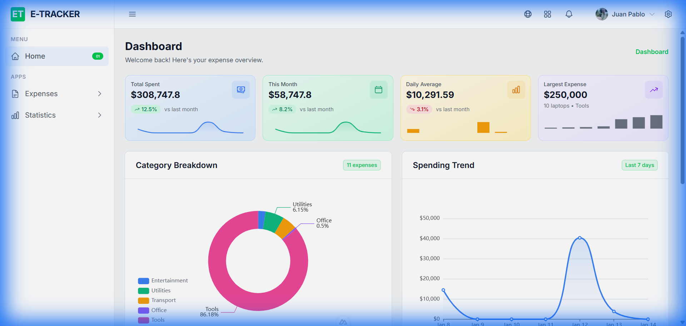
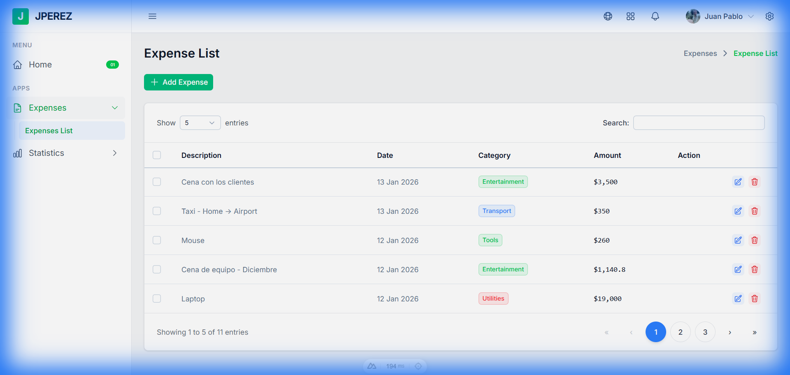

# ExpenseTracker

A modern expense management application built with Nuxt 4, Vue 3, and Nuxt UI. Track your expenses with beautiful visualizations and intuitive interface.

> [!NOTE]
> **🚧 Work in Progress**
> 
> This application demonstrates modern web development practices with Nuxt 4 and Vue 3.
> Currently in **MVP stage** with core functionality implemented. Built for educational purposes
> while following a roadmap toward production-ready features.
> 
> **Roadmap - Production Features:**
> - [ ] Authentication & Authorization
> - [ ] Security hardening & data encryption
> - [ ] Input validation & sanitization
> - [ ] Comprehensive error handling & monitoring
> - [ ] Performance optimizations
>   - Move metric calculations to database level (currently all records are fetched to frontend)
>   - Implement server-side aggregations for dashboard KPIs
>   - Add pagination and lazy loading
> - [ ] Testing suite & CI/CD
>
## ✨ Features

- 📊 **Executive Dashboard** - KPI cards with real-time metrics and charts
- 💰 **Expense Management** - Add, edit, and delete expenses with ease
- 📈 **Visual Analytics** - Category breakdown and spending trends
- 🎨 **Modern UI** - Clean design with dark mode support
- 📱 **Responsive** - Works seamlessly on all devices

## 📸 Screenshots

### Dashboard


### Expense List


## 🚀 Setup

Make sure to install dependencies:

```bash
# npm
npm install

# pnpm
pnpm install

# yarn
yarn install

# bun
bun install
```

## 💻 Development Server

Start the development server on `http://localhost:3001`:

```bash
# npm
npm run dev

# pnpm
pnpm dev

# yarn
yarn dev

# bun
bun run dev
```

## 🏗️ Production

Build the application for production:

```bash
# npm
npm run build

# pnpm
pnpm build

# yarn
yarn build

# bun
bun run build
```

Locally preview production build:

```bash
# npm
npm run preview

# pnpm
pnpm preview

# yarn
yarn preview

# bun
bun run preview
```

## 🛠️ Tech Stack

- **Framework:** Nuxt 4
- **UI Library:** Nuxt UI
- **Charts:** ECharts
- **Styling:** Tailwind CSS
- **Icons:** Heroicons

## 📝 License

MIT

Check out the [deployment documentation](https://nuxt.com/docs/getting-started/deployment) for more information.
